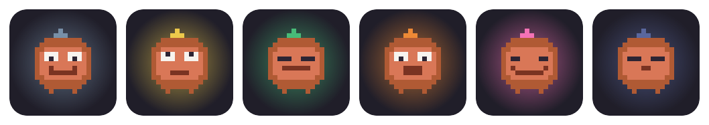
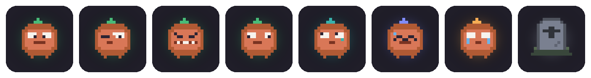
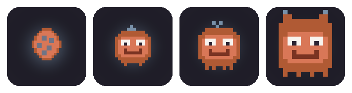
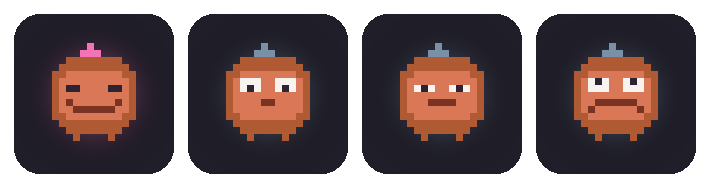

# Claude Familiar 🐾

A little desktop **familiar** for Claude Code on Windows and Linux. It floats a mascot card
on your screen and changes its face to reflect what Claude is doing **live** —
driven entirely by Claude Code's [hooks](https://docs.anthropic.com/en/docs/claude-code/hooks).

<p align="center">
  
  <br>
  <em>The face changes live as Claude works:&nbsp; idle · thinking · working · waiting · happy · sleeping</em>
</p>

<p align="center">
  
  <br>
  <em>…and it wears the work on its face:&nbsp; reading · editing · running · browsing · planning · compacting · oops · out of usage</em>
</p>

One mascot per Claude session. Sub-agents show up as little badges underneath.

The mascot is a **pixel-art creature** styled after Claude's blocky terminal
mascot — 16×16 character grids rasterized to crisp pixmaps by the PySide6 (Qt)
renderer (no image files). Each state has its own face with a sparkle that glows in the state's
accent color. While working, the eyes match the tool (reading / editing /
running / browsing); plan mode gets a pondering `planning` face; compaction a
squeezed-shut `compacting` one. There's a `dizzy` shake easter egg, a teary
`stumble` when a turn dies on an API error, and a pixel-art gravestone when
usage runs out. _(The images in this README are baked from that same sprite by
[`scripts/gen_readme_art.py`](scripts/gen_readme_art.py), so they can't drift.)_

When idle, the face also reflects the **pet's mood** (see below) — droopy when
hungry, sad, sleepy, or sparkly when well cared-for — but Claude-activity states
always take priority, so the mascot never lies about what Claude is doing.

The mascot is a Claude-style blocky pixel creature (`mascot/sprite_pixel.py`).
Its faces are plain 16×16 ASCII grids — edit a grid, see the change. With the
Tamagotchi pet switched off, you can pick which life-stage look it wears (egg /
baby / teen / adult) in **Settings → Appearance → Mascot Look**.

## What it does

- **One card per session.** Multiple Claude windows = multiple cards, stacked in
  the bottom-right corner and labeled by project folder.
- **Live state.** The card face tracks Claude in real time: thinking when you
  submit a prompt, working while a tool runs, waiting when Claude needs you.
- **Effort-reactive background.** The card's panel tints in Claude's own effort
  colors (the exact palette Claude Code uses): a subtle amber at **low**, green at
  **medium**, periwinkle at **high**, an animated **purple wave** at **xhigh**
  (and ultracode), and an animated **rainbow** at **max**. It reads the live
  reasoning effort per session, so the background says how hard Claude is thinking
  at a glance. The waiting-attention pulse always wins the border, and the
  gravestone stays sombre (no effort background). Older Claude Code with no effort
  signal → the card looks exactly as before.
- **Usage bars.** Two thin bars at the bottom of the card show your **5-hour
  session** and **7-day weekly** usage (for Claude subscribers), filled
  traffic-light style — calm below 70%, warning-amber from 70%, alarm-red from 90%
  — so you see a limit coming instead of meeting the gravestone. Each bar empties
  on its own when its window resets. (API-key users, or anyone without the
  statusline feed, simply see an empty row.)
- **Expressive faces.** While working, the eyes match the tool — reading
  (Read/Grep), editing (Edit/Write), running commands (Bash, gritted teeth), or
  browsing the web. In **plan mode** it wears a pondering *planning…* face. When
  Claude Code compacts its context, the mascot squeezes its eyes shut and
  *tidies memories…* — and if a turn dies on a transient API error it shows a
  brief embarrassed *oops…* instead of celebrating. (The compaction face needs
  the `PreCompact` hook — re-run `python scripts/install_hooks.py` if you
  installed before it existed.)
- **Sub-agent badges.** When Claude spawns a sub-agent (the `Agent` tool), a small
  badge appears under the mascot and disappears when it finishes.
- **Celebrate.** When Claude finishes a turn, the mascot does a happy little hop
  before settling back to idle.
- **Pet it.** Click (tap) the mascot and it perks up happily with a few rising
  pixel hearts — a hand-drawn heart sprite, no image files.
- **Sleeping.** After a stretch of idle (90s by default, configurable) the mascot
  dozes off (💤) — and blinks now and then until it does.
- **Resizable.** Pick **small / medium / large** in the settings panel — the whole
  card (creature, text, badges) scales uniformly.
- **Mascot app icon.** Windows shortcuts and the running app use an icon rendered
  straight from the pixel mascot, so the taskbar matches the card on screen.
- **System tray (Windows / Linux / macOS).** A `QSystemTrayIcon` sits in the
  notification area; its menu has *Pet…*, *Show / hide cards*, *Settings…*, and
  *Quit*. On Windows a left-click also shows/hides all the cards.
- **Permission speech bubble + native toast.** When Claude needs you (e.g. a
  permission prompt) or hits a usage limit, a comic-style speech bubble pops up
  over the mascot with the message — and a **native OS notification** (the tray's
  `showMessage`) fires too, so you notice even with the card off-screen or while
  you're in another app. It's edge-triggered, so a prompt toasts once, not on every
  update.
- **Impatient shake.** If a permission/attention prompt goes unanswered for 30s,
  the card starts to shake — and the longer you ignore it, the more frantic it
  gets, until you respond.
- **Gravestone.** When the session runs out of usage (a usage- or session-limit
  notification), the mascot becomes a 🪦 and keeps the message so you can read the
  reset time. It revives on your next prompt.
- **Shake-to-dizzy.** Grab a card and shake it — the mascot gets dizzy (😵‍💫).
- **Self-cleaning.** A card stays as long as its Claude process is alive — even
  idle or asleep — and vanishes the moment that process exits. (A heartbeat
  timeout is a backstop only for sessions whose owner can't be tracked.)

It is **display only** — it never approves anything or interferes with Claude.
Hooks just write a small JSON state file; the widget polls and renders it.

## Raise a pet (Tamagotchi mode) 🥚

Beyond the live status, the familiar is a **virtual pet you raise over time** —
one global creature shared across all your sessions, a delight rather than a chore.

<p align="center">
  
  <br>
  <em>It grows up:&nbsp; egg → baby → teen → adult&nbsp; (gated by both level and real age)</em>
</p>

- **Earn coins from real work.** Finishing a turn (+5), a sub-agent finishing (+3),
  your first prompt of the day (+20), and petting (+1) all earn coins — under a
  gentle **daily cap**, so it never pays to over-use Claude just to farm currency.
- **A shop.** Spend coins on **food** (consumable) and **toys** (reusable, on a
  play cooldown). Some items have trade-offs — an energy drink raises energy but
  lowers happiness — and higher-tier items unlock as the pet levels up.
- **A wardrobe.** 🎩 Cosmetic **hats** the pet actually wears on its card — all
  day, while you work. Shop pieces are coin sinks with level gates that keep
  paying past the last evolution stage (the top hat of the ladder is about a
  week of real work under the daily cap); **milestone pieces can't be bought**
  — a flower for 7 days together, a crown for 30. Days-together and your best
  streak only ever grow, so an earned piece can never be lost. Cosmetics are
  pure delight: zero stat effects, ever. (The egg stays bare — it hatches
  *into* its wardrobe.)
- **Three gentle needs** — hunger, happiness, energy — drift over time; energy
  drains while Claude works and refills while it's idle/asleep. Needs only ever
  dull the mood, **never sickness or death** (the gravestone stays reserved for
  usage limits).
- **Mood on the face.** While idle, the mascot's face reflects the pet's mood, with
  a piece of food or a 💤 popping up at its **upper-right** now and then when it's
  hungry or sleepy (off to the side so they're easy to read, not over its face).
- **It grows up.** The pet earns XP, levels up, and visibly evolves —
  **egg → baby → teen → adult** (gated by both level and real age) — with a
  milestone sparkle at higher levels.
- **The Pet window.** Open it from the tray (*Pet…*), the 🐾 button on a card, or
  Settings. It's the home for the pet: need bars, coins, level, name, inventory,
  and the shop with **Buy / Feed / Play**. Name your pet there too.
- **Glance tooltip.** Hover a card for a compact status — the three need bars,
  coins, level, and name.
- **Reset any time.** Settings → *Reset progress* starts over with a fresh egg.
- **Prefer just the status?** Settings → *Behavior* → uncheck **Enable the Tamagotchi
  pet** turns the card into a **simple hook visualiser** — the same live faces and
  sub-agent badges, but no pet, coins, mood, tooltip, or popups (and the card becomes
  a read-only indicator: tapping it does nothing). Your pet's progress is preserved,
  so flipping it back on picks up where you left off. Takes effect on the next widget
  start, like the other settings.

<p align="center">
  
  <br>
  <em>While idle, the face tints with the pet's mood:&nbsp; cared-for · hungry · tired · sad</em>
</p>

The pet lives in `~/.claude/mascot/pet.json`; the widget is its single writer (it
applies decay and derives coins/XP from your session transitions — the hook
emitter is untouched). The balance numbers (decay rates, coin amounts, level/stage
curves) are easy to tune in `mascot/pet_logic.py`, and item prices/effects in
`mascot/shop.py`.

## Requirements

- **Windows** (tested on Windows 11 Pro) or **Linux** (a compositing desktop;
  freedesktop `.desktop` launchers). The floating card uses real per-pixel
  transparency via Qt, so it composites on Linux too — no chroma-key caveat.
- **Python 3.11+** and **PySide6** (Qt for Python), installed from
  `requirements.txt`. No system Tk needed.
- **Runtime dependencies** are permitted as of
  [ADR-0001](docs/adr/0001-runtime-dependencies.md) / [ADR-0002](docs/adr/0002-pyside6-migration.md).
  They live in `requirements.txt` (`pip install -r requirements.txt`), with
  OS-specific ones gated by environment markers.
- The dev/test tools (`pytest`, `hypothesis`, `ruff`) live in `requirements-dev.txt`:
  `pip install -r requirements-dev.txt`.

## Install

**One-click (recommended):**

```bash
python install.py          # or double-click install.bat
```

This installs Claude Familiar as a real desktop app: it installs the Claude Code
hooks, adds **application-menu and desktop shortcuts** (Start-menu `.lnk` files on
Windows, freedesktop `.desktop` entries on Linux — so you can launch it with the
mascot icon, just like any other app), and opens the **settings panel**. There you can pick the mascot art, choose the
**widget size** (small / medium / large), toggle the transparent floating card,
enable or disable the Tamagotchi pet (off = a simple hook visualiser),
add/remove the app shortcuts, enable run-at-login, and launch the widget.
Reopen it any time with `settings.bat` or `python -m mascot.qt_control_panel`.
Settings live in `~/.claude/mascot/settings.json`.

**Manual (hooks only):**

```bash
# 1. (optional) install dev/test deps
pip install -r requirements.txt

# 2. install the Claude Code hooks (writes to ~/.claude/settings.json)
python scripts/install_hooks.py
```

The install script:
- writes hook entries using the **absolute path** to your current Python
  interpreter and to `hooks/emit.py`, so they work from any cwd;
- also installs a **statusline** command (`hooks/status_emit.py`) that feeds the
  card's 5h/weekly usage bars and prints a compact status line in your terminal
  footer. If you **already** have a custom `statusLine`, the installer leaves it
  untouched and prints how to wire the usage feed in yourself (the bars just stay
  empty until you do) — it never clobbers your setup;
- backs up your original `settings.json` to `settings.json.mascot-backup`;
- is **idempotent** — safe to re-run (it refreshes the entries in place) and
  leaves any other hooks you have untouched.

To remove the hooks later (also removes our statusline, only if it's ours):

```bash
python scripts/install_hooks.py --uninstall
```

## Run

```bash
python -m mascot
```

or, equivalently:

```bash
python run_mascot.py        # script entry point
run_mascot.bat              # double-click launcher
```

Then start a Claude Code session in any folder — a card appears and starts
reacting. Run the widget once; it manages all your sessions.

### Try it without Claude

```bash
python demo.py
```

This spawns two fake sessions (one working, one idle) **and a demo pet**, so you
can see the cards, the idle-face mood, the food/💤 popups, the hover tooltip, and
the Pet window — without a live Claude session. Your real `pet.json` is backed up
and restored on exit, so the demo never touches your actual progress.

## Autostart on login (optional)

So the familiar is always there when you sign in:

1. Press `Win + R`, type `shell:startup`, press Enter. This opens your Startup
   folder.
2. Create a shortcut in that folder pointing at the launcher. To run it **without
   a console window**, target `pythonw.exe`:

   ```
   "C:\Path\To\pythonw.exe" "C:\Users\Vinny\Desktop\claude-mascot\run_mascot.py"
   ```

   (`pythonw.exe` sits next to `python.exe` in your Python install. Set the
   shortcut's *Start in* to the project folder.)

Alternatively, drop a shortcut to `run_mascot.bat` in the Startup folder if you
don't mind a console window.

## How it works

```
Claude Code session ──hooks──▶ emit.py ──atomic write──▶ ~/.claude/mascot/state/<session_id>.json
                                                                  │ (one file per session)
                                                                  ▼  widget polls every second
                                                    one frameless, always-on-top card per session
```

- **`hooks/emit.py`** is invoked by every hook with the event name as an argument
  and the hook payload on stdin. It updates that session's state file with an
  atomic `os.replace` and **always exits 0** — it can never block or break Claude,
  even if the widget isn't running. It also stamps the live reasoning **effort**
  (from the `CLAUDE_EFFORT` env var Claude Code exposes to hook commands), which
  drives the effort-reactive background.
- **`hooks/state_logic.py`** holds `compute_next_state(current, event, payload)`,
  a pure function (the unit-tested core) that maps each hook event to the next
  state.
- **`mascot/qt_app.py`** (`QtMascotApp`) ingests the state directory event-driven
  (a `QFileSystemWatcher` + a slow backstop timer, reads off the UI thread) and
  creates/destroys one translucent Qt card (`mascot/qt_card.py`) per active session.
  The mascot is rasterized from the 16×16 grids in **`mascot/sprite_pixel.py`** by
  the `SpriteRenderer` seam (`mascot/sprite_qt.py`). It is also the single writer
  of the pet (`pet.json`), applying decay and awarding coins/XP from the state
  transitions each cycle.
- **`hooks/status_emit.py`** is installed as Claude Code's **statusline** command.
  Claude hands it the statusline JSON on stdin; it writes the account-global
  **usage** snapshot (5-hour + weekly limits) to `~/.claude/mascot/usage.json` and
  prints a compact `model · effort · 5h% · wk% · dir` line to the terminal footer
  (effort-colored). Like `emit.py` it always exits 0 and never clobbers a good
  snapshot on malformed input. This is a **second, independent writer** (one global
  file, last-writer-wins — the limits are account-wide), so it never races the
  per-session state files. The two pure cores behind it are `mascot/statusline.py`
  (JSON → snapshot + footer) and `mascot/usage.py` (snapshot → decayed bars +
  colors). The Qt card surfaces the snapshot as two bottom **usage bars** (5h +
  weekly, traffic-light colored) and an **effort-reactive panel background** (xhigh
  waves purple, max cycles the rainbow), pushed by `QtMascotApp` each poll. *Note:
  the terminal footer + usage feed run wherever Claude executes the statusline
  command; in editor sessions that don't, the bars show the last-known numbers from
  your terminal sessions (limits are account-global), decayed by each window's reset
  time.*

State files live in `~/.claude/mascot/state/`. Each carries a heartbeat (`ts`)
and the owning `claude.exe` PID; a card is pruned the moment that process exits.

## Project layout

```
claude-mascot/
  mascot/
    qt_app.py         # QtMascotApp: owns the QApplication + cards + tray; single writer of the pet
    qt_ingest.py      # event-driven state ingestion (QFileSystemWatcher, off-thread reads)
    qt_card.py        # the session card: sprite, drag, pet, badges, shake, crossfade motion
    qt_popups.py      # speech bubble + pet status tooltip (frameless Qt Tool windows)
    qt_pet_window.py  # the Pet window: dashboard + shop + items + wardrobe (in-process or standalone)
    qt_control_panel.py # settings panel: art, size, display, install, autostart, hooks, reset pet
    qt_tray.py        # system-tray icon + menu + native toasts (QSystemTrayIcon)
    qt_screens.py     # monitor work areas via Qt (the home-monitor index space)
    sprite_qt.py      # SpriteRenderer: rasterize the grids to cached QPixmaps
    pixel_qt.py       # rasterize a char-grid + palette to a QPixmap (icons)
    effective_state.py# pure overlay: dizzy/happy/sleeping/blink + stall watchdog + idle mood
    overlay.py        # per-card effective-state timers over the pure core
    roster.py         # pure card lifecycle: reconcile(shown, live) -> create/update/destroy
    popup_place.py    # pure multi-monitor popup placement (tested)
    shake.py / particles.py  # pure attention-shake + rising-particle math
    scale.py          # widget-size scaling primitives
    sprite_pixel.py   # Claude-style pixel grids: faces + evolution stages + hats/hearts/emotes
    effort.py         # PURE effort core: normalize + palette + wave/rainbow color math (tested)
    usage.py          # PURE usage core: snapshot -> 5h/weekly bars w/ reset decay + colors (tested)
    statusline.py     # PURE: statusline JSON -> usage snapshot + terminal footer line (tested)
    pet_logic.py      # PURE pet core: decay, item effects, coins/XP, mood, level, stage (tested)
    pet_store.py      # pet.json wrapper: load/save + decay-on-load (single source of truth)
    pet_service.py    # per-cycle pet choreography (decay -> award -> milestone -> persist)
    pet_view.py       # pure pet -> look projection (stage/hat/flourish/mood)
    pet_host.py / pet_actions.py  # the PetHost seam + buy/feed/play/wear over it
    shop.py / cosmetics.py  # data-driven shop + wardrobe catalogs (pure, tested)
    schema.py         # versioned state-file contract validator (the public JSON contract)
    item_art.py       # pixel art for the shop items
    icon.py           # app-icon .ico/.png files rendered from the pixel mascot
    notifier.py       # native-toast core (edge-detect + formatting; Qt tray is the sink)
    single_instance.py# one-widget-at-a-time guard (named mutex / flock)
    settings.py       # load/save ~/.claude/mascot/settings.json
    osplatform.py     # IS_WINDOWS / IS_LINUX / IS_MACOS + monitor work areas
    desktop_entry.py  # write freedesktop .desktop launchers (Linux)
    shortcuts.py      # app shortcuts: .lnk (Windows) / .desktop (Linux)
    autostart.py      # run-at-login entry: Startup .lnk (Windows) / XDG autostart (Linux)
    state_store.py    # read state dir; prune by process liveness (staleness backstop)
    proc.py           # is the owning claude process still alive? (psutil)
    config.py         # paths, timeouts, sizes (UI_SCALE), colors
    __main__.py       # python -m mascot
  hooks/
    emit.py           # invoked by every hook; stdin JSON -> atomic state update (+ effort stamp)
    status_emit.py    # statusline command: stdin JSON -> usage.json + terminal footer
    state_logic.py    # compute_next_state (pure, tested)
    proc.py           # find owning Claude PID via process ancestry (psutil)
  scripts/
    install_hooks.py  # install/uninstall hooks in ~/.claude/settings.json
    gen_readme_art.py # bake the README showcase PNGs from the sprite grids
  tests/              # pytest suite (pure cores + offscreen Qt)
  install.py          # one-click installer (install.bat wraps it)
  settings.bat        # open the settings / control panel
  run_mascot.py       # entry point
  run_mascot.bat      # double-click launcher
  demo.py             # preview with fake sessions
  docs/PLAN.md        # design notes & phase tracker
  docs/images/        # README showcase art (generated by gen_readme_art.py)
```

The app icon (`assets/claude_familiar.ico`) is generated from the pixel mascot on
install (and whenever autostart is enabled), so it is not checked into the repo.

## Tests

```bash
pip install -r requirements-dev.txt   # pytest + hypothesis + ruff + mypy (dev-only)
python -m pytest -q                    # tests
python -m ruff check .                 # lint
python -m mypy mascot hooks            # static type-check
```

Covers the state machine, the **pet engine** (decay, item effects, coins/XP with
the daily cap, mood, level, stage, and the shop buy/feed/play), and the file-I/O
wrappers (`emit`, `pet_store`). The example-based cases in `tests/test_phase1.py`
are complemented by **property-based tests** (`tests/test_properties.py`,
[Hypothesis](https://hypothesis.readthedocs.io/)) that fuzz the pure cores'
invariants — stat clamping, immutability, the daily coin cap, level monotonicity,
and stage non-regression. GUI is excluded — verified visually via `demo.py`.

Linting is [Ruff](https://docs.astral.sh/ruff/) (config in `ruff.toml`, line
length 99); `ruff check` is the gate. `ruff format` is intentionally not run as a
bulk pass — the source is hand-formatted, so the lint config leaves layout alone.
Static typing is [mypy](https://mypy.readthedocs.io/) (config in `mypy.ini`);
`python -m mypy mascot hooks` passes clean. Third-party deps without bundled stubs
(psutil, pywin32) are `ignore_missing_imports` per-module.

## Troubleshooting

- **No card appears when Claude runs.** Make sure the widget is running
  (`python -m mascot`) and that hooks installed cleanly — re-run
  `python scripts/install_hooks.py` and check `~/.claude/settings.json`. The
  widget needs a Python with `PySide6` installed (`pip install -r requirements.txt`).
- **Card lingers after closing a terminal.** It should vanish the moment the
  Claude process exits. If a session crashed in a way that hides its process from
  the widget, an owner-less card is pruned by the staleness backstop (~5 min).
- **Wrong Python gets used by hooks.** Re-run the install script *with the Python
  you want* — it records `sys.executable` at install time.
- **Desktop icon says "Untrusted" (Linux/GNOME).** GNOME marks newly created
  `.desktop` launchers untrusted until you allow them. Click the icon and choose
  **Allow Launching**, or mark it trusted from a terminal:
  `gio set ~/Desktop/claude-familiar.desktop metadata::trusted true`
  (the application-menu entry doesn't need this).
- **No system-tray icon.** The tray needs a notification area to host it. If the
  desktop has no tray host, the widget runs exactly the same, just without an icon.
  Open settings with `python -m mascot.qt_control_panel` and quit the widget from
  its launcher/process.
- **Only one widget runs at a time.** Launching the widget again (e.g. autostart
  plus a manual launch) is a no-op — a single-instance guard makes the second one
  exit cleanly, so cards never appear doubled.

## Uninstall

```bash
python scripts/install_hooks.py --uninstall   # remove hooks
python -c "from mascot import launcher; launcher.uninstall()"  # remove Start-menu/desktop shortcuts
```

(You can also remove the shortcuts from the settings panel's **Install** section.)
Then delete the project folder. Leftover state files (if any) live in
`~/.claude/mascot/`.
